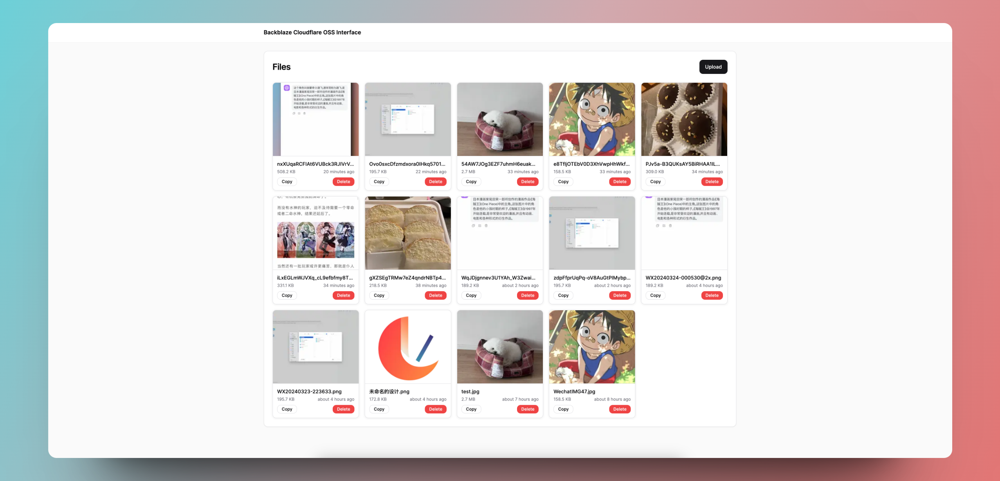
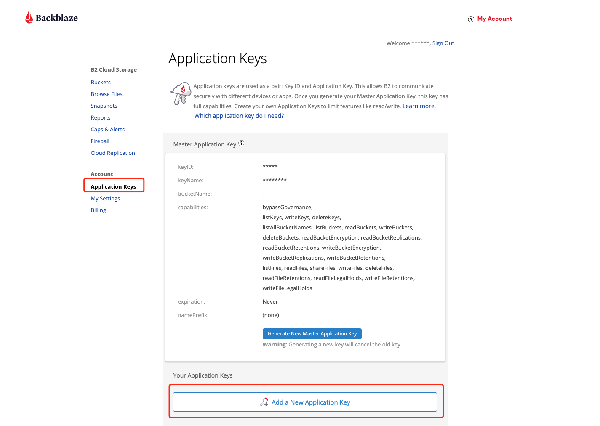
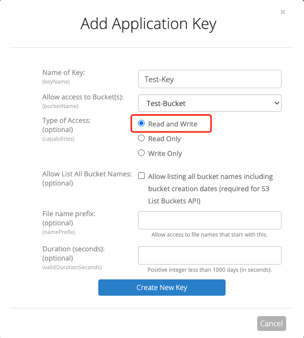
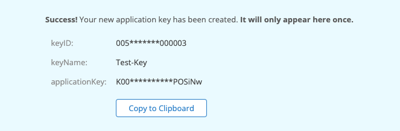
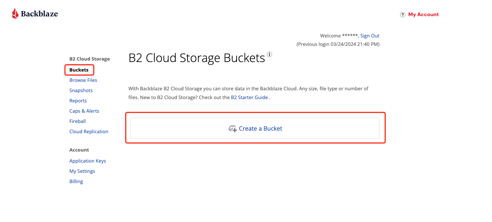
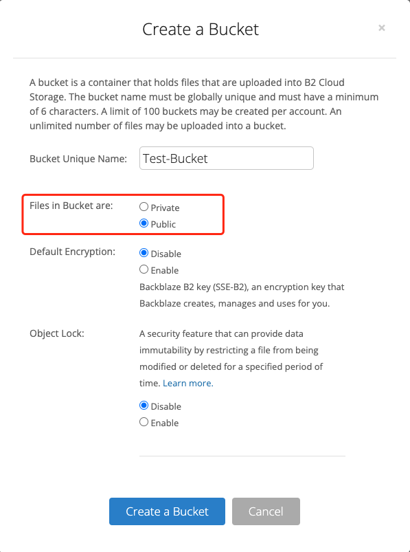
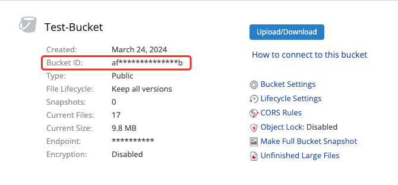
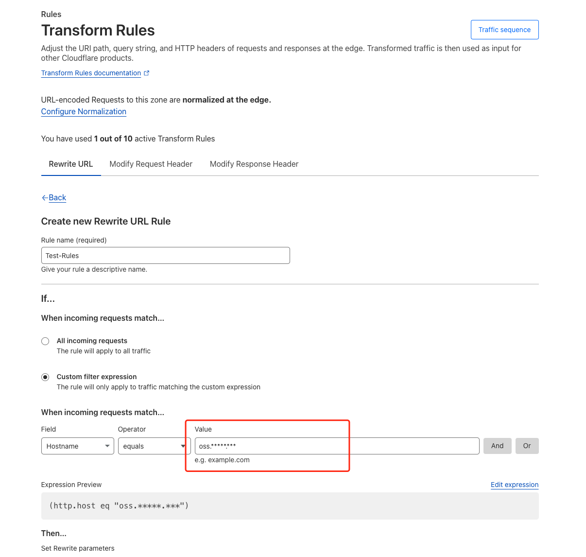
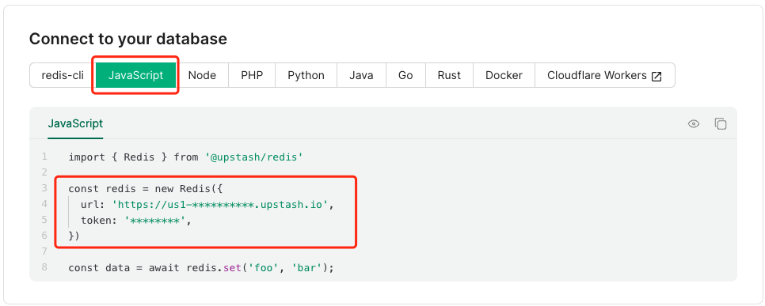

# Backblaze Cloudflare OSS Interface

Inspired by [Backblaze + Cloudflare搭建个人OSS](https://leezhian.com/faq/other/bb-cf-oss), this project aims to provide a simple interface to manage files in Backblaze B2 using Cloudflare Workers.

## Features

- **Deploy for free with one-click** on Vercel
- Quickly view Backblaze resources
- Support upload and delete files

## Roadmap

- [ ] Batch delete
- [ ] Pagination of Data
- [ ] Basic permission verification (to avoid direct viewing of all documents)

## Before You Start

Please carefully read "[Backblaze + Cloudflare搭建个人OSS](https://leezhian.com/faq/other/bb-cf-oss)". Follow the instructions to complete:

- Register for a Backblaze account
- Set up Cloudflare with domain name resolution

## Getting Started

### Environment Variables

#### `APP_KEY_ID` (required)

This allows B2 to communicate securely with different devices or apps.

- Step1: Add a New Application Key

  

- Step2: Name your key and choose a bucket

  > **Type of Access: Read and Write**

  

- Step3: Then you can get your `APP_KEY_ID` and `APP_KEY`

  `keyID` ===> `APP_KEY_ID`

  `applicationKey` ===> `APP_KEY`

  

#### `APP_KEY` (required)

Look up ⬆️

#### `BUCKET_ID` (required)

Create a bucket in Backblaze B2.

- Step1: Create a bucket

  

- Step2: Name your bucket

  > **`Files in Bucket`** select **`Public`**

  

- Step3: `Bucket ID` ===> `BUCKET_ID`

  

#### `NEXT_PUBLIC_HOSTNAME` (required)

Please provide the domain name you configured in the Transform Rules on Cloudflare.

#### `UPSTASH_REDIS_REST_URL` (optional)

Configuring Redis can reduce the consumption of [Transactions Class C calls](https://www.backblaze.com/cloud-storage/transaction-pricing).

Reference Document: [Upstash Redis](https://upstash.com/docs/redis/overall/getstarted)

After completing the creation, you will receive the following information:

`url` ===> `UPSTASH_REDIS_REST_URL`

`token` ===> `UPSTASH_REDIS_REST_TOKEN`

#### `UPSTASH_REDIS_REST_TOKEN` (optional)

Look up ⬆️

### Enjoy
